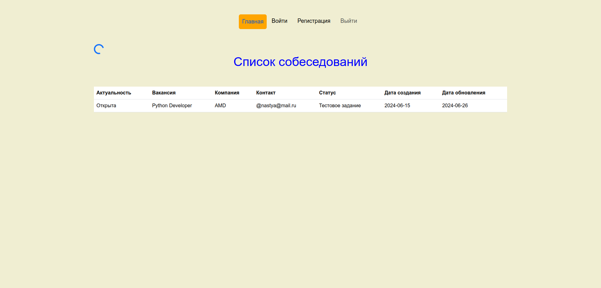

# Проект "Список собеседований" на FastAPI и Vue.js

  
Задачи

  
FastAPI

  - [x] Создание виртуального окружения
  - [х] Установка библиотек
  - [х] Подключение к базе данных
  - [х] Новое приложение users
  - [х] Создание миграций
  - [х] Функция для хеширования пароля
  - [х] Функция создания jwt токена
  - [х] Установка и подключение celery и redis
  - [ ] Асинхронная функция для верификации пользователя

  
Vue

  - [x] Создание проекта
  - [x] Установка axios
  - [x] Страница регистрации
  - [x] Страница авторизации
  - [x] Главная страница
  - [x] Компонент Header
  - [x] Глобальный компонент Spinner

