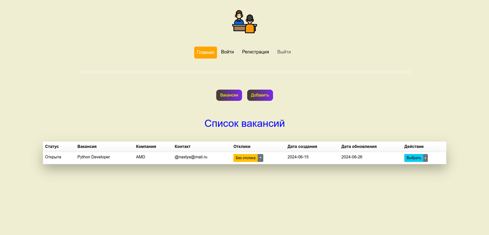

# Проект "Список собеседований" на FastAPI и Vue.js

---
### Задачи

  
FastAPI

  - [x] Создание виртуального окружения
  - [x] Установка библиотек
  - [x] Подключение к базе данных
  - [x] Новое приложение users
  - [x] Создание миграций
  - [x] Функция для хеширования пароля
  - [x] Функция создания jwt токена
  - [x] Установка и подключение celery и redis
  - [ ] Асинхронная функция для верификации пользователя

  
Vue

  - [x] Создание проекта
  - [x] Установка axios
  - [x] Страница регистрации
  - [x] Страница авторизации
  - [x] Главная страница
  - [x] Компонент Header
  - [x] Глобальный компонент Spinner

---

### Стек

  
FastAPI

  - FastAPI
  - PostgreSQL
  - Alembic
  - SQLAlchemy
  - Redis
  - Celery

  
Vue

  - Vue3 (Composition API)
  - Axios
  - Vue-router
  - Pinia
  - Vue-toast-notification
  - Bootstrap

---